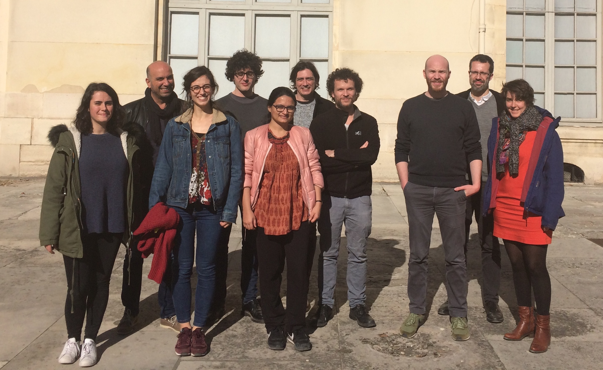

# Gammapy Coding Sprint, February 2019, Paris

* Start: Monday, February 25, 2019 at 2 pm
* End: Friday, March 1, 2019 at noon
* Location: Paris, France. Observatoire de Paris, salle du Levant.
* Contacts: [Régis Terrier](mailto:rterrier@apc.univ-paris7.fr), [Axel Donath](mailto:axel.donath@mpi-hd.mpg.de)

This meeting is a "coding sprint" for people who commit to develop Gammapy
(http://gammapy.org/). The objective is to distribute tasks defined
in several PIGS and implement new features in Gammapy.
This is **not** a workshop how to use Gammapy. We will also not do any tutorials how to hack on Gammapy, i.e. teach
git, Github, Python, pytest and Sphinx. Instead we will pair experienced and new
people and learn hands-on. If you want to prepare a bit, have a look at
[gammapy-dev-tutorial](https://github.com/gammapy/gammapy-dev-tutorial) and
learn a bit on your own before the coding sprint. Join the [Gammapy Slack](https://gammapy.slack.com) and
feel free to ask anything there.

The meeting is supported by the Action Fédératrice CTA of the Observatoire de Paris.

## Travel and hotel

[How to reach Observatoire de Paris](https://www.obspm.fr/acces-au-site-de-paris.html?lang=en)

## Location of the meeting

The meeting will take place in the observatoire de Paris, salle du Levant.

Entrance is at Avenue Denfert Rochereau, 77. The salle du Levant is in the northern part of the historical building. Two possible paths are indicated on the following [plan](plan_paris_291117-1200.pdf).

## Agenda

### Monday

Remote connection will be possible with eZuce (connection detail are [here](ezuce.txt)).

| Time          | Program          |
| ------------- |----------------- |
| 14.00 - 15.30 | Presentations 1  |
| 15.30 - 16.00 | Coffee Break     |
| 16.00 - 18.00 | Presentations 2 / Coding / Discussion Session |

#### Presentations (Gammapy Code Status and Plans for the Week):

* Regis Terrier: Welcome and general infos (5 min.) 
* Fabio Pintore: Event sampling (Remote, 15 min.) [[slides](slides/Event_simulator.pdf)]
* Luca Giunti: Spatial models (10 min.) [[slides](https://github.com/gammapy/gammapy-meetings/blob/master/coding-sprints/2019-02_Paris/slides/Spatial_Models.pdf)]
* Atreyee Sinha: Maps / IRFMapMaker / MapDataset (15 min.) [[slides](https://github.com/gammapy/gammapy-meetings/blob/master/coding-sprints/2019-02_Paris/slides/maps.pdf)]
* Judit Pérez Romero / José Enrique Ruiz: Extension for dark matter module (15 min.) [[slides](https://github.com/gammapy/gammapy-meetings/blob/master/coding-sprints/2019-02_Paris/slides/extension_dark_matter_module.pdf)]
* Monica Seglar Arroyo: Finding gamma transients in simulated GW follow-ups with Gammapy (15 min.) [[slides](https://github.com/gammapy/gammapy-meetings/blob/master/coding-sprints/2019-02_Paris/slides/GWfollowup_IncludeTime.pdf)]
* Axel Donath: Gammapy Roadmap / Project suggestions for the coding sprint (10 min.) [[slides](https://github.com/gammapy/gammapy-meetings/blob/master/coding-sprints/2019-02_Paris/slides/gammapy-status-project-suggestions.pdf)]
* Discussion time (60 min.)

### Tuesday to Friday

| Time          | Program          |
| ------------- |----------------- |
| 9.00 - 12.30  | Coding Session   |
| 12.30 - 14.00 | Coding Lunch     |
| 14.00 - 18.00 | Coding Session   |

## Registered Participants

1. Régis Terrier, APC, IN2P3/CNRS, France ([registerrier](https://github.com/registerrier))
2. Axel Donath, MPIK Heidelberg, Germany ([adonath](https://github.com/adonath))
3. José Enrique Ruiz, IAA-CSIC Granada, Spain ([bultako](https://github.com/bultako))
4. Jouvin Léa,IFAE, Barcelona, Spain ([JouvinLea](https://github.com/JouvinLea))
5. Atreyee Sinha, APC, IN2P3/CNRS, France ([AtreyeeS](https://github.com/AtreyeeS))
6. Fabio Acero, DAp, CEA-Saclay, France ([facero](https://github.com/facero))
7. Judit Pérez-Romero, IFT UAM-CSIC, Madrid, Spain ([peroju](https://github.com/peroju))
8. Monica Seglar-Arroyo, CEA-Saclay, France ([mseglar](https://github.com/mseglar))
9. Luca Giunti, APC & DAp, IN2P3/CNRS & CEA_Saclay, France ([luca-giunti](https://github.com/luca-giunti))
10. Bruno Khelifi, APC, IN2P3/CNRS, France ([bkhelifi](https://github.com/bkhelifi))
11. Julien Lefaucheur, DAp, CEA-Saclay, France ([jjlk](https://github.com/jjlk))

