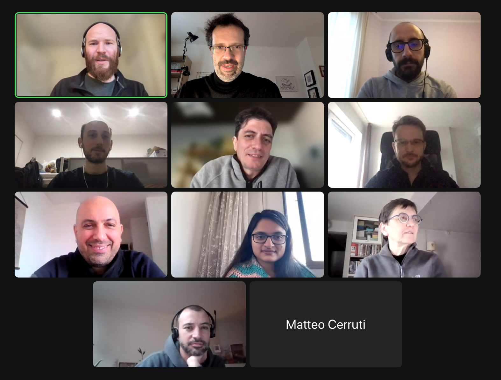

# Gammapy Co-Working Week, January 2022

The next "Gammapy co-working week" will be held from January 24th to 28th 2022.

Ideally all participants can dedicate most of their time to work on Gammapy during the week and make sure they are available for spontaneous discussions on Slack and remote meetings via Zoom.

A Zoom room will be open the full week.  ID: 837 3792 5932.

[https://u-paris.zoom.us/j/83737925932](https://u-paris.zoom.us/j/83737925932)

Password given on Slack (#dev channel).

Communication via Slack on #dev channel in the meantime.

The main objective is the finalization of v1.0 (documentation, clean-up and possible missing API features). We will summarize user feedback and implement possible changes.

Mentoring sessions for new comers will be organized to help getting involved in the development process. 

## Group photo

## Agenda
Topics:
- Solving issues: https://github.com/gammapy/gammapy/issues
- Improve docs: https://github.com/gammapy/gammapy/issues/3143
- CTA data challenge requirements with CTAO 
- Gammapy paper session

### Monday
##### Afternoon session
* Kick-off meeting (2 pm) - [slides](coding%20sprint%20intro.pdf)
* Open project discussion for the week
  * Open issues to solve: see [project](https://github.com/orgs/gammapy/projects/2) 
  * Documentation [project](https://github.com/orgs/gammapy/projects/1/views/1)
  * Energy dependent ON-region [project](https://github.com/orgs/gammapy/projects/3)
* [New docs template overview](https://www.iaa.csic.es/~jer/gammapydocs/index.html) (José Enrique), how to decide?

### Tuesday
##### Morning session (10am)
##### Afternoon session (2pm)
* Discussion on paper: 
  * https://github.com/gammapy/gammapy-paper
  * Meetings will take place weekly on Monday at 3pm
* Discussion on timing (3pm)
  * conversion to time series. See this [test](https://github.com/gammapy/gammapy/blob/master/gammapy/estimators/points/tests/test_lightcurve.py#L125)
  * astropy tools: [Lomb-Scargle](https://docs.astropy.org/en/stable/timeseries/lombscargle.html) , [bayesian blocks](https://docs.astropy.org/en/stable/api/astropy.stats.bayesian_blocks.html)
    

### Wednesday
##### Morning session (9:30am)
##### Afternoon session (2pm)
- Science Data Challenge: discussions on the requirements (from physics to codes) - 2pm

### Thursday
##### Morning session (9:30am)
- Un-binned likelihood analysis - 10 am
- Follow-up on time resolved spectroscopy [see issue](https://github.com/gammapy/gammapy/issues/3616)

##### Afternoon session (2pm)
- Gammapy development workflow after v1.0
  - PIG 23: adapt https://numpy.org/neps/nep-0029-deprecation_policy.html and https://github.com/astropy/astropy-APEs/blob/main/APE18.rst
  - PIG 24: adapt https://github.com/astropy/astropy-APEs/blob/main/APE2.rst
- Gammapy governance and roles (write short PIG). Also define GitHub roles...  - 3:30 pm 
  - Not urgent but we should start discussing now
  - Develop and discuss and document on webpage?
  - Responsibilities:
    - Coordination committee 
    - Subpackage maintainer
    - Lead developers
    - Project managers
    - CI/Docs/Test maintainer
    - Community engagement: Slack, Twitter, GitHub Discussions
    - gammapy validation & performance
    - gamma-sky & gamma-cat?
    - gammapy recipes
    - gammapy.org maintainer
    - Core package release coordinator (tag releases, conda packages, feature freeze etc.)
    - Ombudsperson?
    - What about Gammapy meetings? User meetings? Coding sprints organisation? (now project managers...)
    - Contributors
### Friday
##### Morning session (9:30am)
##### Afternoon session (2pm)
- Close out meeting (2 pm)

## Participants
1. Régis Terrier, APC, Paris ([registerrier](https://github.com/registerrier))
2. José Enrique Ruiz, IAA-CSIC, Granada ([bultako](https://github.com/bultako))
3. Bruno Khélifi, APC, Paris ([bkhelifi](https://github.com/bkhelifi))
4. Atreyee Sinha, UCM, Madrid ([AtreyeeS](https://github.com/AtreyeeS)))
5. Laura Olivera Nieto, MPIK, Heidelberg ([LauraOlivera](https://github.com/LauraOlivera))
6. Fabio Pintore, INAF/IASF Palermo, ([fabiopintore](https://github.com/fabiopintore))
7. Axel Donath, CfA, Cambridge MA([adonath](https://github.com/adonath))
8. Cosimo Nigro, IFAE, Barcelona ([cosimoNigro](https://github.com/cosimoNigro))
9. Luca Giunti, APC, Paris ([luca-giunti](https://github.com/luca-giunti))
10. Matteo Cerruti, APC, Paris ([mcerruti](https://github.com/mcerruti))
11. Catherine Boisson, LUTH, Meudon
12. Quentin Remy, MPIK, Heidelberg ([QRemy](https://github.com/QRemy))
13. Maximilian Nöthe, TU Dortmund, ([maxnoe](https://github.com/maxnoe))
14. Tim Unbehaun, ECAP Erlangen, ([tunbehaun273](https://github.com/tunbehaun273))
